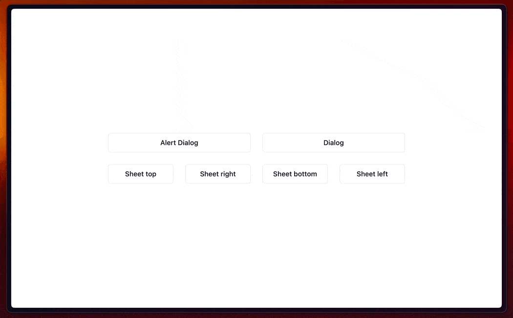

# oc-14-react-dialog

> [!CAUTION]
> This repository contains a project completed as part of my training at [OpenClassrooms](https://openclassrooms.com). Having successfully concluded the program, the project is now archived and is no longer maintained. Please note that the repository remains available for reference purposes only; some links or features may not work as expected.



## Project Overview

In this project, I was required to select and convert a plugin from this [project](https://github.com/OpenClassrooms-Student-Center/P12_Front-end) to React. I opted to recreate a dialog plugin.

### Useful Links

- [Original Plugin](https://github.com/kylefox/jquery-modal)
- [New Plugin on npm](https://www.npmjs.com/package/@oc-wh/react-dialog)

## Details

This dialog, along with its variants, is built on top of the [Radix Dialog](https://www.radix-ui.com/primitives/docs/components/dialog#dialog) and [Radix Alert Dialog](https://www.radix-ui.com/primitives/docs/components/alert-dialog#alert-dialog) primitives to ensure accessibility. For styling, I've used [Tailwind CSS](https://tailwindcss.com/).

## Installation

```bash
pnpm install @oc-wh/react-dialog
```

## Components

### Alert Dialog

> An interruptive modal dialog presenting important content and expecting a user response.

1. Imports

   ```jsx
   import {
     AlertDialog,
     AlertDialogAction,
     AlertDialogCancel,
     AlertDialogContent,
     AlertDialogDescription,
     AlertDialogFooter,
     AlertDialogHeader,
     AlertDialogTitle,
     AlertDialogTrigger,
   } from '@oc-wh/react-dialog'
   ```

2. Anatomy

   ```jsx
   <AlertDialog>
     <AlertDialogTrigger></AlertDialogTrigger>
     <AlertDialogContent>
       <AlertDialogHeader>
         <AlertDialogTitle></AlertDialogTitle>
         <AlertDialogDescription></AlertDialogDescription>
       </AlertDialogHeader>
       <AlertDialogFooter>
         <AlertDialogCancel></AlertDialogCancel>
         <AlertDialogAction></AlertDialogAction>
       </AlertDialogFooter>
     </AlertDialogContent>
   </AlertDialog>
   ```

### Dialog

> A window overlaying either the primary window or another dialog window, rendering the underlying content inactive.

1. Imports

   ```jsx
   import {
     Dialog,
     DialogContent,
     DialogDescription,
     DialogHeader,
     DialogTitle,
     DialogTrigger,
   } from '@oc-wh/react-dialog'
   ```

2. Anatomy

   ```jsx
   <Dialog>
     <DialogTrigger></DialogTrigger>
     <DialogContent>
       <DialogHeader>
         <DialogTitle></DialogTitle>
         <DialogDescription></DialogDescription>
       </DialogHeader>
     </DialogContent>
   </Dialog>
   ```

### Sheet

> An extension of the Dialog component, displaying complementary content to the main content of the screen.

1. Imports

   ```jsx
   import {
     Sheet,
     SheetContent,
     SheetDescription,
     SheetHeader,
     SheetTitle,
     SheetTrigger,
   } from '@oc-wh/react-dialog'
   ```

2. Anatomy

   ```jsx
   <Sheet>
     <SheetTrigger></SheetTrigger>
     <SheetContent>
       <SheetHeader>
         <SheetTitle></SheetTitle>
         <SheetDescription></SheetDescription>
       </SheetHeader>
     </SheetContent>
   </Sheet>
   ```

#### Side Property

Use the `side` property on the `<SheetContent />` to specify the screen edge where the component will appear. Acceptable values are `top`, `right`, `bottom`, or `left`.

### Customization

All components are fully customizable with the `className` property. When using `Tailwind CSS`, the plugin employs [clsx](https://github.com/lukeed/clsx) and [Tailwind merge](https://github.com/dcastil/tailwind-merge). This allows you to use all the [Tailwind CSS](https://tailwindcss.com/) classes without bloating your bundle size.

## License

This project is licensed under the MIT License. For more details, see the [LICENSE](./LICENSE.txt) file.
